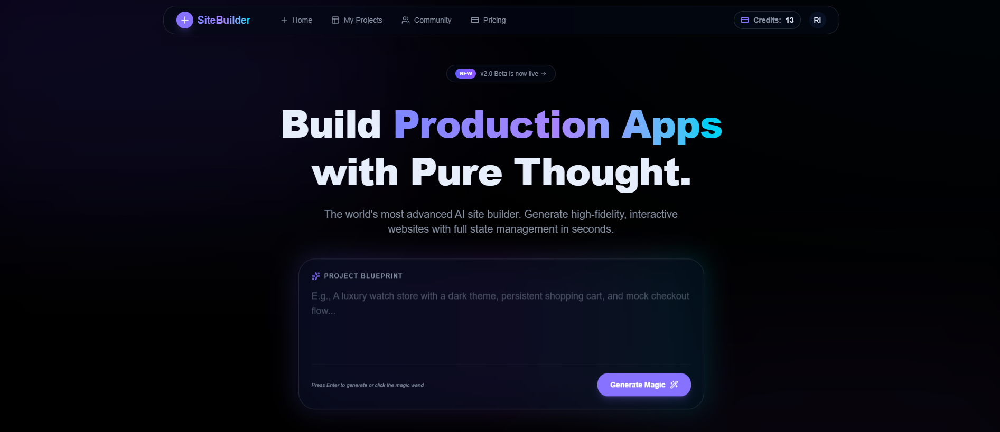
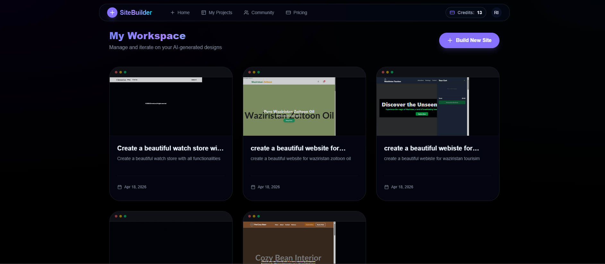

# AI Website Builder

AI Website Builder is a full-stack SaaS-style application that transforms natural language prompts into interactive website prototypes. It gives users a complete creation flow: generate a project with AI, refine it through follow-up prompts, preview the result live, save manual edits, export the HTML, and publish selected projects to a public showcase.

## Overview

This project was built as a modern AI product experience rather than a basic prompt box. The platform combines AI-driven code generation with project management, authentication, version tracking, and a public publishing workflow. The result is a practical foundation for an AI-powered website builder or creative prototyping platform.

## Key Features

- AI website generation from natural language prompts
- AI-assisted revisions for updating an existing project
- Version history with rollback support
- Live preview inside a dedicated editor experience
- Manual code saving for custom edits
- HTML export for generated projects
- Publish and unpublish controls for community visibility
- Authentication and session management with Better Auth
- Credit-based product model with pricing UI

## Screenshots

Add your screenshots here before publishing the repository publicly.

```md



```

Recommended captures:

- Landing page hero and prompt input
- Editor view with sidebar and live preview
- My Projects dashboard
- Published community showcase

## Tech Stack

- Frontend: React, TypeScript, Vite, Tailwind CSS, React Router
- Backend: Node.js, Express, TypeScript
- Database: PostgreSQL with Prisma
- Authentication: Better Auth
- AI Integration: OpenAI SDK with OpenRouter-compatible configuration

## Product Flow

1. A signed-in user enters a prompt describing the website they want.
2. The backend creates a project record and starts AI generation asynchronously.
3. The generated HTML is saved as the current project version.
4. The user opens the editor to preview, revise, save, export, publish, or roll back the project.

## Architecture

```text
.
|-- client/   # React + Vite frontend
|-- server/   # Express API, auth, Prisma, AI generation
```

### Frontend

- Handles authentication flows, landing page UX, project dashboard, editor, preview pages, pricing, settings, and community browsing
- Uses Axios for API requests and Better Auth client utilities for session handling

### Backend

- Exposes authenticated routes for project creation, revision, publishing, saving, versioning, and personal project management
- Uses Prisma with PostgreSQL for persistence
- Calls an OpenAI-compatible API to enhance prompts and generate project code

## Environment Variables

Create `server/.env`:

```env
DATABASE_URL=
AI_API_KEY=
BETTER_AUTH_URL=
BETTER_AUTH_SECRET=
TRUSTED_ORIGINS=http://localhost:5173,http://localhost:3000
NODE_ENV=development
```

Create `client/.env`:

```env
VITE_BASEURL=http://localhost:3000
```

## Local Development

### 1. Install dependencies

```bash
cd client
npm install
```

```bash
cd server
npm install
```

### 2. Run Prisma migrations

```bash
cd server
npx prisma migrate dev
```

### 3. Start the backend

```bash
cd server
npm run start
```

### 4. Start the frontend

```bash
cd client
npm run dev
```

Local URLs:

- Frontend: `http://localhost:5173`
- Backend: `http://localhost:3000`

## Scripts

### Client

- `npm run dev` starts the Vite development server
- `npm run build` builds the frontend for production
- `npm run preview` previews the production frontend locally

### Server

- `npm run start` runs the server with `tsx`
- `npm run server` runs the server with `nodemon`
- `npm run build` compiles the backend TypeScript project

## Deployment

This project is split into a separate frontend and backend, so the easiest production setup is:

- Deploy `client` to Vercel or Netlify
- Deploy `server` to Render, Railway, or another Node-compatible host
- Use a hosted PostgreSQL database
- Set matching frontend and backend environment variables, especially `TRUSTED_ORIGINS`, `BETTER_AUTH_URL`, and `VITE_BASEURL`

### Deployment Checklist

- Set a production `DATABASE_URL`
- Set `AI_API_KEY`
- Set `BETTER_AUTH_SECRET`
- Set `BETTER_AUTH_URL` to your backend auth base URL
- Set `TRUSTED_ORIGINS` to include your production frontend domain
- Set `VITE_BASEURL` in the frontend to your deployed backend URL
- Run Prisma migrations against the production database

## Current Status

Implemented today:

- User authentication
- Project generation and revision flow
- Version persistence and rollback
- Project dashboard and preview flow
- Project publishing and community browsing
- Credit tracking in the data model

Still in progress:

- Payment integration for purchasing credits
- More advanced account and project settings
- Expanded collaboration or team features

## Notes

- Generated projects are currently stored as standalone HTML documents.
- The pricing page is present, but payment processing is not implemented yet.
- AI generation depends on valid API credentials and a working PostgreSQL database.

## Why This Project Stands Out

- It combines product design, backend architecture, database modeling, authentication, and AI integration in one app
- It goes beyond generation by including revision history, previews, exports, and publishing
- It is a strong portfolio project for showcasing full-stack and AI product engineering skills

## License

This project is available under the `ISC` license defined in the server package.
